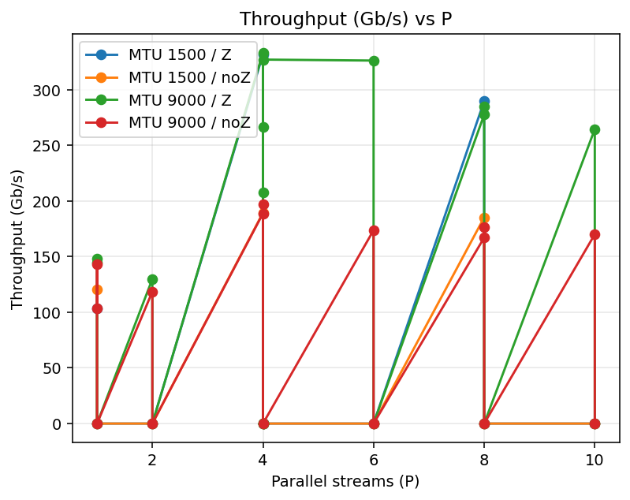

# netns-iperf-lab

[](https://github.com/Matt-C-G/netns-iperf-lab/actions/workflows/ci.yml)


Reproducible `iperf3` experiments using Linux network namespaces, veth, `fq` qdisc, and BBR.  
Includes scripts to **spin up the topology**, **run tests**, **aggregate JSON → CSV**, and **plot** results.

## TL;DR (one liner)
```bash
make            # builds data/summary.csv and analysis/*.png from existing JSON

```   # closes the README.md code fence

## Quickstart
make setup                            # create ns1<->ns2 with BBR + fq
MTU=9000 P=4 Z=Z DUR=15 make run      # run a single iperf3 test, write JSON
make summary                          # rebuild data/summary.csv from JSON
make plot                             # produce analysis/throughput_vs_P.png
make clean                            # tear down namespaces

## Result preview
Throughput vs parallel streams (grouped by MTU & zerocopy):



(Also generated: analysis/retrans_vs_P.png)

## Repo layout
- scripts/ – setup/run/clean + make_summary.sh (uses jq)
- data/json/ – raw iperf3 JSON
- data/summary.csv – aggregated results
- analysis/ – plots generated from the CSV
- Makefile – one-command workflows
- GitHub Actions – validates JSON→CSV on every push and uploads the CSV artifact

## Why this is interesting
- Network namespaces + fq qdisc + BBR tuning
- MTU (1500 vs 9000) and zerocopy across P streams
- Reproducible pipeline: raw → CSV → plots

MIT ©
